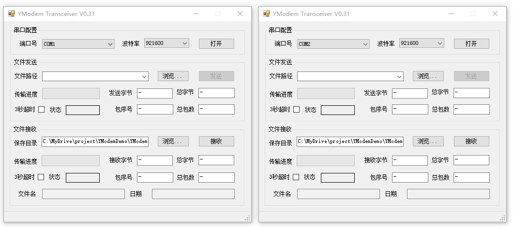
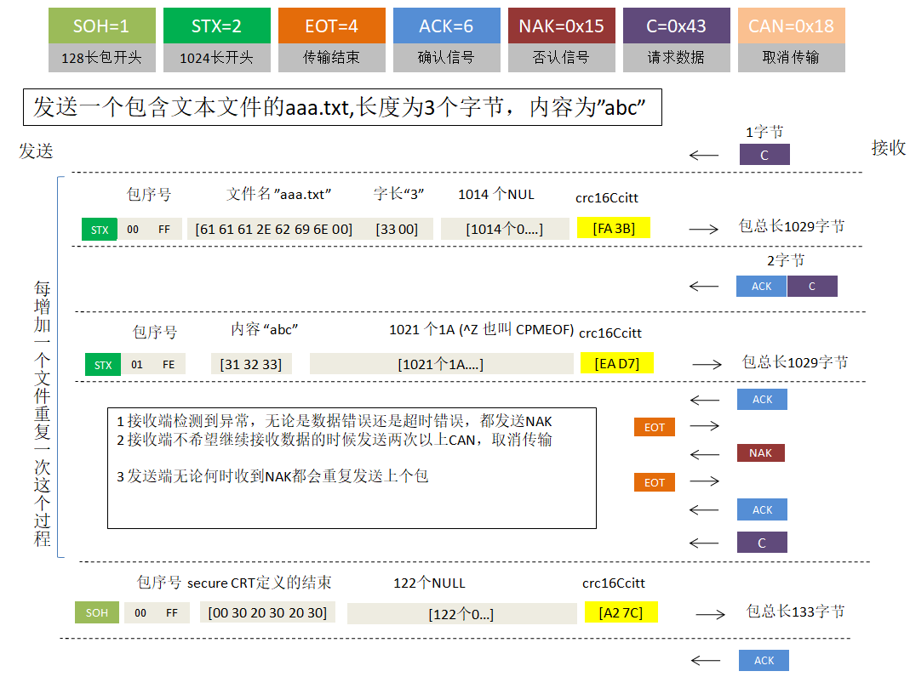

# 使用 C# 语言编写的 YModem 通用读写程序

## 功能：

1. 与Secure CRT 1K 收发模式完全兼容
2. 支持1k发送方式
3. 支持128字节、1K字节接收
4. 支持多文件读写
5. MIT方式全开源

## YModem 简明协议示意图

## 附件：

YMODEM协议参考中文译制版
XMODEM-YMODEM-Protocol-Refrence_881014